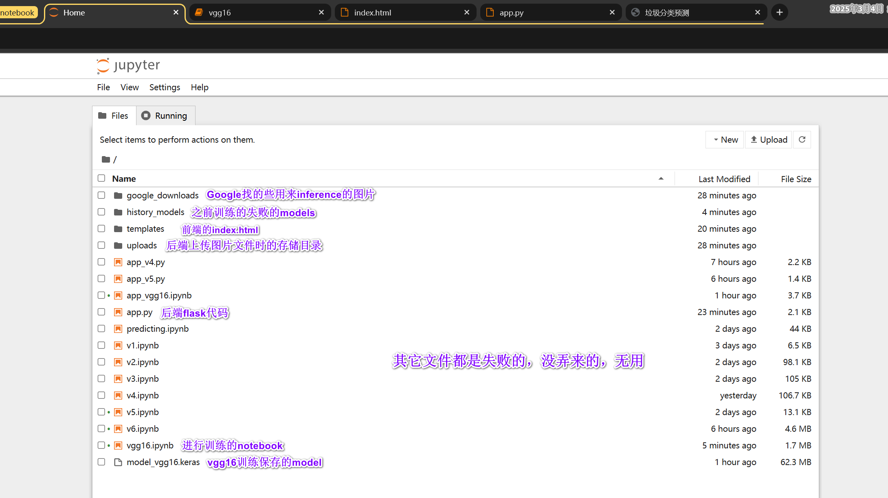

# 

 

| 项目名称 |   智能垃圾分类系统   |
| :------: | :------------------: |
|   学院   | 计算机科学与技术学院 |
|   班级   |    2021级软件1班     |
|   成员   | 方大为/2021413010205 |


## 一、点击标题 可直达

### 1.[演示视频](resources/video_demo.mp4)

path: 

```raw
resources/video_demo.mp4
```

<video src="resources/video_demo.mp4"></video>


### 2.[我的报告](resources/我的报告/我的报告.pdf)

path: 

- [.md](resources/my_report/my_report.md)
- [.pdf](resources/my_report/my_report.pdf)

```raw
resources/my_report/my_report.md
resources/my_report/my_report.pdf
```


### 3.[src目录的结构](resources/file_structure.png)

path:

```raw
resources/file_structure.png
```



此截图不全，后面又新添一个重要的分析评估性能用的文件：analysis.ipynb

- 分析包括模型效果（如分类精度，准确度，召回率，F1分值）以及模型复杂度（模型大小、#计算量、推理时间等）


### 4.model[训练代码的详解](resources/vgg16_code_analysis/vgg16_code_analysis.md)

path:

```raw
resources/vgg16_code_analysis/vgg16_code_analysis.md
```


### 5. [PPT演示文稿](resources/my_report/ppt_demo.pdf)

path:

- [.ppt](resources/我的报告/ppt_demo.pptx)
- [.pdf](resources/我的报告/ppt_demo.pdf)

```python
resources/my_report/ppt_demo.pptx
resources/my_report/ppt_demo.pdf
```


## 二、如何启动该项目？

- 此项目绝大部分使用notebook完成：进入src目录，于此path打开cmd，输入`jupyter notebook`即可

- 对于后端的app.py：也是src目录下打开cmd，输入`python app.py`，浏览器里打开120.0.0.1:5000网页
