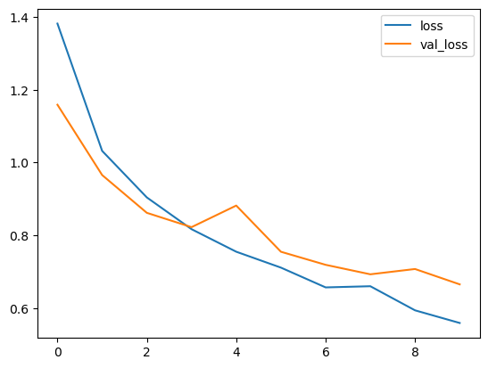
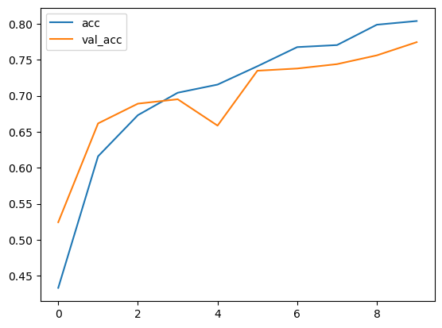
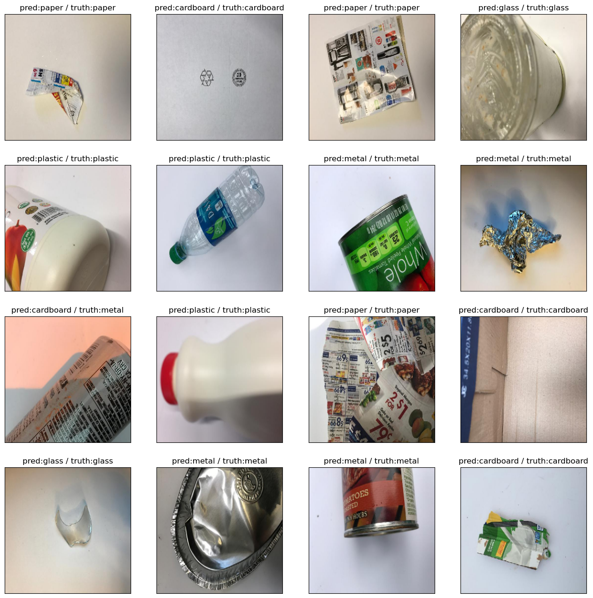
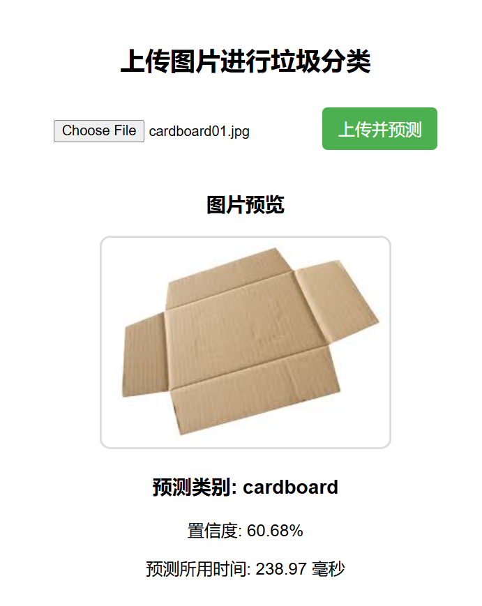
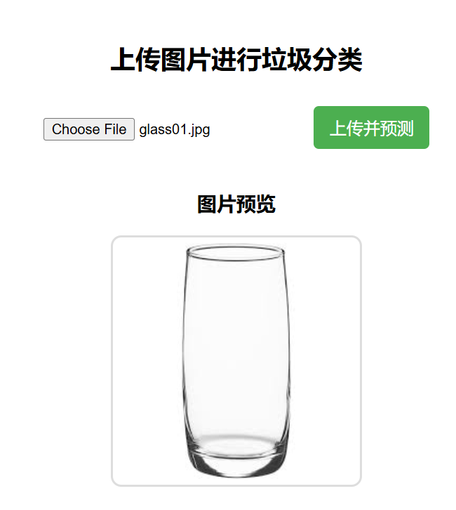
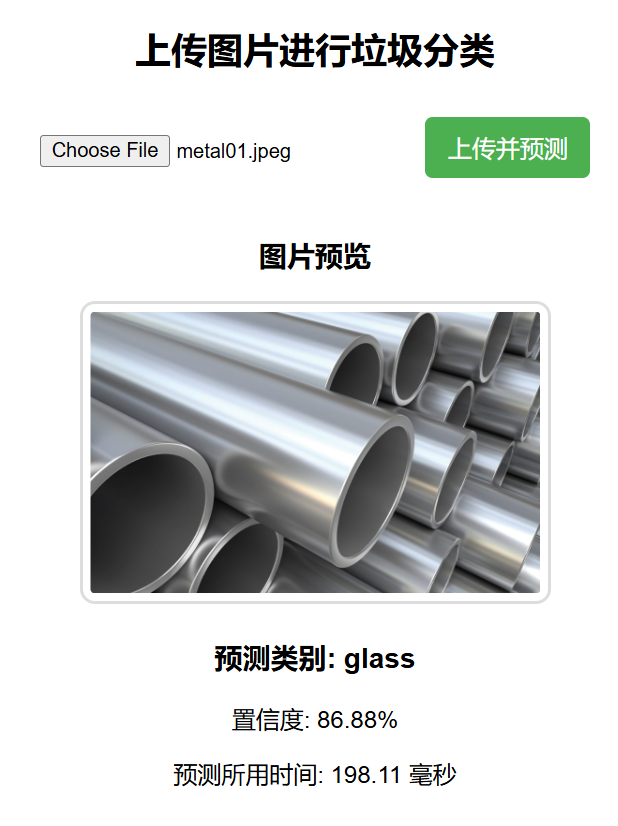
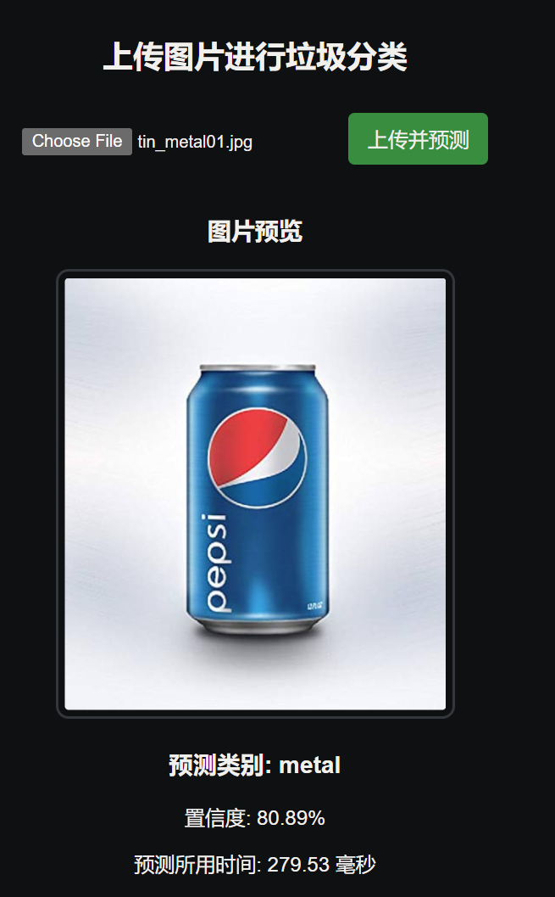

# 

 

| 项目名称 |   智能垃圾分类系统   |
| :------: | :------------------: |
|   学院   | 计算机科学与技术学院 |
|   班级   |    2021级软件1班     |
|   成员   | 方大为/2021413010205 |

# 软件工程专业  

# 综合实训项目报告


## 摘要

随着城市化进程的加快，垃圾分类已成为全球关注的重要环保问题。垃圾分类不仅有助于资源回收，还能减少环境污染，提高垃圾处理的效率。然而，由于人们对垃圾分类知识的了解有限，手动分类的准确性和效率往往较低。因此，基于深度学习的垃圾分类系统可以为这一问题提供智能化的解决方案。

本项目采用预训练的VGG16模型，并在此基础上进行迁移学习，以实现对垃圾分类的自动识别。通过数据预处理、模型优化、测试评估等步骤，我们训练并部署了一个高效的垃圾分类模型，并最终搭建了一个基于 Flask 的 Web 端应用，实现在线垃圾分类预测。

## 关键词（3～5个）

Waste/Trash/Garbage Classification垃圾/废物分类, Transfer Learning迁移学习, Deep learning深度学习

## 一．项目背景

近年来，随着居民生活水平的提高和消费结构的日益丰富，生活垃圾的数量呈爆发式增长，许多城市正面临“垃圾围城”的困境（“garbage siege” (Chen, Chen, Chui, Fan, Han, 2019, Xu, Li, Ou, Wu, 2015)）。垃圾分类被认为是提升资源利用效率和保护环境的有效手段，并已在全球范围内作为管理措施得到积极推广。然而，由于垃圾种类繁多、居民分类意识薄弱以及相关政策尚不完善，垃圾分类的实施效果并不理想。因此，探索一种高效的自动垃圾分类方法具有重要的学术价值和现实意义。

城市人口的迅速增长和城市化工业化进程的急速加快，导致生活废物垃圾的数量随之急剧增长，传统的垃圾处理方式依赖于人工分类，这既耗时又低效，而且容易出现人为错误。这已经难以满足可持续发展的需求。为了应对这些挑战，基于机器学习的生活垃圾智能分类系统应运而生。人工智能驱动的垃圾分类系统作为一种有希望的解决方案受到了关注。通过整合深度学习技术，特别是卷积神经网络(CNN)，这些系统可以准确识别不同类型的垃圾，并促进自动分类，这样不仅可以大幅度提高垃圾的分类效率，降低处理成本，还能有效减少环境污染。本项目旨在利用预训练的VGG16模型开发智能垃圾分类系统，优化分类性能，为可持续环境治理提供实用工具。

人工智能技术的发展为这一问题提供了新的解决方案。许多学者基于深度学习技术设计了智能垃圾分类算法（Azhaguramyaa et al., 2021; Kang et al., 2020; Mao et al., 2021; Zhang et al., 2021a; Zhang et al., 2021b）。这些方法可直接应用于智能垃圾分类设备，如智能垃圾桶、垃圾分选机、智能垃圾站及移动应用程序，从而有效提升垃圾分类的效率。然而，目前仍然存在模型结构复杂、推理时间较长、计算成本较高等问题。垃圾分类技术的主要应用对象是分类设备，而此类设备通常在执行动作前需先进行识别，即控制器需在获取识别结果后才能向执行机构发送指令。如果无法保证垃圾的实时识别，控制过程将产生显著延迟，甚至可能导致系统崩溃，从而影响分类效果。此外，考虑到实际应用场景，若为每台设备配备高性能图形处理单元（GPU），将导致巨大的芯片成本，这在经济上并不现实。相比之下，执行电机的速度较易控制，即便选择更高速的电机，其成本增加也相对可控。因此，决定整个系统运行速度的关键因素是计算平台。近年来，轻量级深度学习模型取得了重要进展，它们在保证精度的同时，显著减少了计算量和模型大小，为嵌入式设备实现垃圾分类提供了理论和技术支持。

在计算机视觉任务中，大型神经网络模型取得了卓越成果，如 AlexNet（Krizhevsky et al., 2012）、GoogLeNet（Szegedy et al., 2015）和 ResNet（He et al., 2016）。然而，这些模型因体积庞大、结构复杂，通常仅能运行在高算力 GPU 设备上，这促使研究者们开始关注深度学习的轻量化发展。近年来，诸多轻量级神经网络相继被提出，如 Xception（Chollet, 2017）、MobileNet（Sandler et al., 2018）和 ShuffleNet（Zhang et al., 2018）。这些网络在保证分类精度的同时，具有更小的模型尺寸和更快的推理速度，使得深度学习模型能够直接运行在边缘计算设备上。

鉴于轻量级神经网络在推理速度上的优势，大量学者已将其应用于图像分类任务。例如，Gfa et al. (Fu et al., 2019) 基于 SqueezeNet 预训练骨干网络进行迁移学习，设计了一种用于钢表面缺陷检测的快速分类模型，在 TITAN X 平台上实现了 100 帧/秒（FPS）的推理速度；Tang et al. (2020) 采用 ShuffleNet 作为主干网络，并结合通道注意力机制优化模型，提出了一种轻量级葡萄病害分类模型，该模型参数仅为 1.1M，识别准确率达 99.14%；Jia et al. (2021) 设计了一种基于 MobileNet v3 的轻量级胸部 X 光（CXR）新冠肺炎分类模型，通过逐点卷积加权组合输出，实现了 99.6% 的分类精度，模型参数仅 1.86M；Gao et al. (2021)基于新型空间注意力机制和迁移学习，构建了一种轻量级垃圾分类网络，在华为云平台上的垃圾分类任务中取得了 96.17% 的准确率，计算量约 450M FLOPs；Yang and Li (2020)借鉴主流深度学习网络结构，采用深度可分离卷积，并引入注意力机制，提出了一种轻量级垃圾分类网络 WasNet，在自建的家庭垃圾数据集上取得了 82.5% 的分类准确率，模型参数量仅 1.5M。

上述研究从多个方面改进了轻量级网络，在保持模型轻量化的同时提升了分类精度。因此，本研究旨在利用深度学习模型的特征提取能力，提升垃圾分类的自动化水平，并设计一种基于 VGG16 的高效垃圾分类算法，以提高分类精度并优化计算效率。本研究采用 VGG16 作为基础网络，并在以下三个方面进行优化，以实现精准、稳定的垃圾分类：

1. 在 VGG16 网络的基础上添加自定义全连接层，以优化特征提取和分类能力；
2. 结合数据增强和优化超参数设置，以提升模型的泛化能力并降低过拟合风险；
3. 利用迁移学习（Tan et al., 2018）进行模型训练，充分利用预训练权重，以加快收敛速度并提高分类性能。

------


## 二．数据集与预处理方法

### 数据集获取

本项目使用 **Kaggle 提供的垃圾分类数据集**（Garbage Classification Dataset），该数据集包含 **2527 张垃圾图片**，共 **6 类**，所有图片大小皆为：512*384

| category  | 汉       | counts |
| --------- | -------- | ------ |
| cardboard | 纸板     | 403    |
| glass     | 玻璃     | 501    |
| metal     | 金属     | 410    |
| paper     | 纸张     | 594    |
| plastic   | 塑料     | 482    |
| trash     | 一般垃圾 | 137    |

#### folder tree view：

- ```raw
   └─Garbage classification
       ├─cardboard-(403 images)
       ├─glass-(501 images)
       ├─metal-(410 images)
       ├─paper-(594 images)
       ├─plastic-(482 images)
       └─trash-(137 images)
   ```

   

#### 训练集train、验证集val、测试集test的划分

数据集已被分为训练集、验证集和测试集，文件路径及标签存储在 `.txt` 文件中：

- 训练集（`one-indexed-files-notrash_train.txt`）
- 验证集（`one-indexed-files-notrash_val.txt`）
- 测试集（`one-indexed-files-notrash_test.txt`）


### 数据预处理

1. **加载数据**：从 `.txt` 文件中读取数据，并转换为 Pandas DataFrame。
2. **添加类别前缀**：由于数据集的文件名不包含类别信息，因此我们对路径进行处理，使其包含类别信息。
3. **数据归一化**：采用 `ImageDataGenerator` 对图像进行归一化（将像素值缩放到 [0,1] 区间）。


```python
gen_train = gen.flow_from_dataframe(
    dataframe=df_train,
    directory=IMAGES_DIR,
    x_col='path',
    y_col='label',
    color_mode="rgb",
    class_mode="categorical",
    batch_size=32,
    shuffle=True
)

gen_valid = gen.flow_from_dataframe(
    dataframe=df_valid,
    directory=IMAGES_DIR,
    x_col='path',
    y_col='label',
    color_mode="rgb",
    class_mode="categorical",
    batch_size=32,
    shuffle=True
)

test_gen = gen.flow_from_dataframe(
    dataframe=df_test,
    directory=IMAGES_DIR,
    x_col='path',
    y_col='label',
    color_mode="rgb",
    class_mode="categorical",
    batch_size=32,
    shuffle=False
)
```

```raw
Found 1768 training, 328 validation and 328 samples.
Found 1768 validated image filenames belonging to 6 classes.
Found 328 validated image filenames belonging to 6 classes.
Found 328 validated image filenames belonging to 6 classes.
```


#### 数据增强策略Data Augmentation

**图像大小调整**：将所有图片调整为 224×224 以适应 VGG16

**数据归一化**：将像素值缩放到 [0,1]。


## 三．模型设计、训练与评价

### 3.1 模型结构

本项目基于 VGG16 预训练模型进行迁移学习。VGG16 是一种深度卷积神经网络，由 16 层卷积层和全连接层组成，在 ImageNet 数据集上表现优异。

- **输入层**：224×224×3 RGB 图像
- **卷积层**：5 组卷积块，每组包含 2-3 个卷积层
- **池化层**：最大池化层（MaxPooling）
- **全连接层**：添加 1024 维隐藏层
- **输出层**：使用 Softmax 激活函数，输出 6 个类别的预测概率


### 3.2 模型训练设置

> 如损失函数、优化器、学习率、训练时长等调试；
>

是使用CPU训练的，CUDA等一系列软件下载安装后还是没能成功使用GPU进行训练。

深度学习框架：Tensorflow

- **损失函数**：`categorical_crossentropy`
- **优化器**：Adam
- **评估指标**：分类准确率（`categorical_accuracy`）
- **批次大小**：32
- **训练轮次**：10
- 训练时长：约30min

### 3.3 实现过程

1. **导入必要的库**：NumPy、Pandas、Matplotlib、TensorFlow、Keras 等。
2. **定义数据预处理函数**，加载数据集并进行归一化。
3. **构建 VGG16 模型**，去除原始的全连接层，添加新的自定义全连接层。
4. **编译与训练模型**，使用训练集进行优化，并在验证集上评估性能。
5. **模型评估**，使用测试集计算准确率，并绘制混淆矩阵。
6. **结果可视化**，绘制损失曲线、准确率曲线，并对部分测试样本进行预测可视化。
7. **模型部署**，使用 Flask 搭建 Web 应用，实现在线垃圾分类预测。

### 3.4 训练过程

```python
C:\Users\fangw\AppData\Roaming\Python\Python312\site-packages\keras\src\trainers\data_adapters\py_dataset_adapter.py:121: UserWarning: Your `PyDataset` class should call `super().__init__(**kwargs)` in its constructor. `**kwargs` can include `workers`, `use_multiprocessing`, `max_queue_size`. Do not pass these arguments to `fit()`, as they will be ignored.
  self._warn_if_super_not_called()
Epoch 1/10
56/56 ━━━━━━━━━━━━━━━━━━━━ 170s 3s/step - categorical_accuracy: 0.3388 - loss: 1.5526 - val_categorical_accuracy: 0.5244 - val_loss: 1.1588
Epoch 2/10
56/56 ━━━━━━━━━━━━━━━━━━━━ 175s 3s/step - categorical_accuracy: 0.6056 - loss: 1.0544 - val_categorical_accuracy: 0.6616 - val_loss: 0.9655
Epoch 3/10
56/56 ━━━━━━━━━━━━━━━━━━━━ 176s 3s/step - categorical_accuracy: 0.6727 - loss: 0.9155 - val_categorical_accuracy: 0.6890 - val_loss: 0.8617
Epoch 4/10
56/56 ━━━━━━━━━━━━━━━━━━━━ 170s 3s/step - categorical_accuracy: 0.6952 - loss: 0.8358 - val_categorical_accuracy: 0.6951 - val_loss: 0.8224
Epoch 5/10
56/56 ━━━━━━━━━━━━━━━━━━━━ 171s 3s/step - categorical_accuracy: 0.7316 - loss: 0.7353 - val_categorical_accuracy: 0.6585 - val_loss: 0.8817
Epoch 6/10
56/56 ━━━━━━━━━━━━━━━━━━━━ 172s 3s/step - categorical_accuracy: 0.7475 - loss: 0.6965 - val_categorical_accuracy: 0.7348 - val_loss: 0.7548
Epoch 7/10
56/56 ━━━━━━━━━━━━━━━━━━━━ 182s 3s/step - categorical_accuracy: 0.7721 - loss: 0.6442 - val_categorical_accuracy: 0.7378 - val_loss: 0.7189
Epoch 8/10
56/56 ━━━━━━━━━━━━━━━━━━━━ 174s 3s/step - categorical_accuracy: 0.7737 - loss: 0.6694 - val_categorical_accuracy: 0.7439 - val_loss: 0.6928
Epoch 9/10
56/56 ━━━━━━━━━━━━━━━━━━━━ 167s 3s/step - categorical_accuracy: 0.7877 - loss: 0.6128 - val_categorical_accuracy: 0.7561 - val_loss: 0.7074
Epoch 10/10
56/56 ━━━━━━━━━━━━━━━━━━━━ 166s 3s/step - categorical_accuracy: 0.7961 - loss: 0.5665 - val_categorical_accuracy: 0.7744 - val_loss: 0.6652
```


- 训练过程中，模型的准确率从 33.8% 提升到 79.6%。
- 验证集的准确率最终达到 77.4%。
- 训练损失逐步下降，表明模型在不断学习特征。


### 性能评估

> 包括模型效果（如分类精度，准确度，召回率，F1分值）以及模型复杂度（模型大小、计算量、推理时间等）；
>

- ## **1. 模型分类效果分析**

   我的模型在测试集上的表现如下：

   - **准确率（Accuracy）**: **77.44%** —— 整体分类正确率较高，说明模型已学到了垃圾分类的关键特征。
   - **精确率（Precision）**: **78.46%** —— 在预测为某类别的样本中，有 **78.46%** 是正确的。
   - **召回率（Recall）**: **77.44%** —— 实际属于某类别的样本中，有 **77.44%** 被正确分类。
   - **F1 分数（F1-score）**: **77.06%** —— 精确率和召回率的平衡指标，反映了模型的综合分类能力。

   ### **1.1 类别分析**

   | 类别               | 精确率 (Precision) | 召回率 (Recall) | F1 分数(F1-score) | 样本数 (Support) |
   | ------------------ | ------------------ | --------------- | ----------------- | ---------------- |
   | 硬纸板 (cardboard) | **0.81**           | **0.91**        | **0.86**          | 46               |
   | 玻璃 (glass)       | 0.64               | **0.88**        | 0.74              | 65               |
   | 金属 (metal)       | 0.76               | 0.66            | 0.70              | 56               |
   | 纸张 (paper)       | **0.89**           | **0.87**        | **0.88**          | 83               |
   | 塑料 (plastic)     | **0.83**           | 0.64            | 0.72              | 61               |
   | 其他垃圾 (trash)   | 0.70               | **0.41**        | 0.52              | 17               |

   **分析：**

   1. **纸张 (paper) 和 硬纸板 (cardboard) 分类表现最佳**
      - 纸张 F1 分数 **0.88**，硬纸板 **0.86**，说明模型对这两类垃圾的区分效果较好。
      - 可能是因为数据集中 **纸张和硬纸板的样本质量较高，纹理和颜色特征较明显**。
   2. **玻璃 (glass) 召回率较高，精确率较低**
      - **召回率 0.88**：意味着模型能很好地识别玻璃垃圾，不太容易漏检。
      - **精确率 0.64**：但容易误判其他类别为玻璃。
   3. **塑料 (plastic) 分类存在挑战**
      - **召回率 0.64**：说明有 **36% 的塑料垃圾被误分类**。
      - 可能是因为塑料的外观多变，与其他类别的相似度较高。
   4. **其他垃圾 (trash) 分类效果较差**
      - **F1 分数仅 0.52**，召回率 **0.41**：说明大部分 **trash** 样本被误分类。
      - 可能的原因：
         - 训练数据中 `trash` 类样本较少，导致模型学习不到足够的特征。
         - `trash` 可能与多个类别的特征相似，难以区分。

   ### **1.2 解决方案**

   - 增强数据集：
      - 收集 **更多 `trash` 类样本**，提高模型对该类的识别能力。
      - 使用 **数据增强**（旋转、颜色变换、模糊等）来提升塑料和玻璃的区分能力。
   - 改进模型：
      - 采用 **Focal Loss** 代替 `categorical_crossentropy`，提升模型对难分类样本的关注度。
      - 使用 **ResNet / EfficientNet** 代替 VGG16，以提高分类能力。
   - 后处理优化：
      - 采用 **类别权重调整**，提高 `trash` 和 `plastic` 的识别权重，减少误分类。

   ------

   ## **2. 模型复杂度分析**

   我的模型在计算资源消耗方面的数据如下：

   - **模型大小**: **62.30 MB**
   - **推理时间**: **388.36 ms / 每张图片**

   ### **2.1 模型大小**

   - VGG16 作为一个 **较大** 的 CNN（卷积神经网络），其 **62.3 MB** 的大小在服务器端运行没有问题，但对于移动端或嵌入式设备可能过大。
   - 优化方案：
      - **剪枝 (Pruning)**：减少不重要的神经元，压缩模型。
      - **量化 (Quantization)**：使用 TensorFlow Lite，将模型转换为 `float16` 或 `int8` 以减少存储占用。

   ### **2.2 推理时间**

   - **单张图片推理时间 388.36 毫秒**，较长，适合 **离线批量推理**，但 **不适合实时应用（如手机 APP）**。
   - 优化方案：
      - 换用轻量级模型：
         - 使用 **MobileNetV3 或 EfficientNet-Lite**，推理速度可提升 **3-5 倍**。
      - TensorRT 加速：
         - 若在 GPU 上部署，可以使用 NVIDIA TensorRT 进行模型优化，加快推理速度。
      - 批量推理：
         - 如果是在服务器端进行大规模推理，可以 **增加批处理 (batch_size)** 来提高吞吐量。

   ------

   ## **3. 总结**

   | 指标                   | 结果               | 备注                                      |
   | ---------------------- | ------------------ | ----------------------------------------- |
   | **准确率 (Accuracy)**  | **77.44%**         | 整体分类效果不错，但 `trash` 识别较差     |
   | **精确率 (Precision)** | **78.46%**         | 大部分类别分类较精准，但 `glass` 精确率低 |
   | **召回率 (Recall)**    | **77.44%**         | `trash` 召回率低，意味着漏检较多          |
   | **F1 分数 (F1-score)** | **77.06%**         | 平衡指标，整体表现一般                    |
   | **模型大小**           | **62.30 MB**       | 适合服务器端部署，移动端可能需要优化      |
   | **推理时间**           | **388.36 ms / 图** | 速度较慢，需优化                          |

   ------

   ## **4. 未来优化方向**

   ### **4.1 提高分类性能**

   ✅ **数据增强**：提高 `plastic` 和 `glass` 识别能力。
    ✅ **增加 `trash` 类样本**，减少误分类。
    ✅ **使用 Focal Loss**，提高对易混淆类别的学习能力。
    ✅ **换用更优的 CNN 模型**（如 ResNet、EfficientNet）。

   ### **4.2 优化计算性能**

   ✅ **剪枝 (Pruning) 和 量化 (Quantization)**，降低模型大小，提高推理速度。
    ✅ **使用 TensorFlow Lite 或 TensorRT**，加速推理，提高应用效率。
    ✅ **换用 MobileNetV3 / EfficientNet-Lite**，适用于移动端应用。

   ------

   


## 四．系统设计与开发

> 系统设计与开发：Web前端上传及显示图片，后端运行模型推理及返回结果。
>

本系统分为 **前端、后端、深度学习模型** 三个部分：

- **前端（web前端三件套）**：提供网页上传图片，显示预测结果。
- **后端（Flask API）**：加载模型，接收请求，返回分类结果。
- **深度学习模型（TensorFlow）**：执行垃圾分类任务。

## 五．测试结果与分析

### 5.1 测试集评估

在测试集上评估模型，得到的准确率为 **77.44%**。通过混淆矩阵分析，不同类别的分类准确率存在一定差异，其中：

- 纸张（paper）与硬纸板（cardboard）易混淆。
- 金属（metal）和塑料（plastic）分类较准确。
- 其他垃圾（trash）分类误差较大，可能是数据集中该类样本较少。

### 5.2 结果可视化

1. **损失与准确率曲线**
   - 训练损失逐渐下降，验证损失趋于稳定，表明模型没有明显的过拟合。
      
   - 训练准确率稳步上升，最终达到 79.6%。
      
2. **预测结果可视化**
   - 选取 16 张测试图像，展示模型的预测类别和真实标签。
   - 
3. **混淆矩阵**
   - 通过 `ConfusionMatrixDisplay` 绘制混淆矩阵，观察分类错误的主要原因。
   - 

### 5.3自行下载的图片进行上传预测推理











## 六．实训总结与展望

### 6.1 项目总结

本项目采用 VGG16 预训练模型，通过迁移学习实现垃圾分类。实验结果表明，该方法可以较准确地分类 6 种垃圾类别，最终在测试集上取得 77.44% 的准确率。

项目亮点：

- 充分利用迁移学习，提高了小样本数据集上的分类性能。
- 采用数据增强方法，提高模型的泛化能力。
- 部署 Web 端应用，支持用户在线上传图片进行分类预测。

### 6.2 未来优化方向

1. **提高分类准确率**
   - 增加数据样本，特别是 `trash` 类的数量。
   - 采用更深的模型（如 ResNet、EfficientNet）进一步优化分类性能。
2. **模型优化**
   - 进行超参数优化（如调整学习率、优化器等）。
   - 多使用其他预训练模型进行对比
   - 采用蒸馏学习等方法，提高轻量化模型的性能。
3. **系统部署**
   - 使用 TensorFlow Lite 或 ONNX，将模型部署到移动端或嵌入式设备。
   - 采用更高效的 Web 框架，如 FastAPI，提升响应速度。
4. **垃圾分类应用扩展**
   - 结合物联网（IoT）设备，实现智能垃圾桶自动分类。
   - 增加更多垃圾类别，如电子垃圾、厨余垃圾等，提高实用性。

本项目为垃圾分类提供了一种智能化解决方案，未来可以进一步优化模型和系统，以提升实际应用效果。


## 参考文献

1. Mostly goes to: ChatGPT, DeepSeek
2. [垃圾分类的数据集](https://www.kaggle.com/datasets/asdasdasasdas/garbage-classification?resource=download)
3. [Garbage Classification-MobilenetV2 [92% Accuracy]](https://www.kaggle.com/code/alexfordna/garbage-classification-mobilenetv2-92-accuracy)：前期仿照这个预训练模型MobilenetV2训练出来的模型的拟合数据很好，但是预测推理的准确性太差只有20＋%，故弃用了这个
4. [Waste Classification using Transfer Learning](https://www.kaggle.com/code/devanshiipatel/waste-classification-using-transfer-learning/notebook)：后面最主要参考vgg16预训练模型
5. [Google's ML crash course](https://developers.google.com/machine-learning/crash-course/linear-regression/loss)
