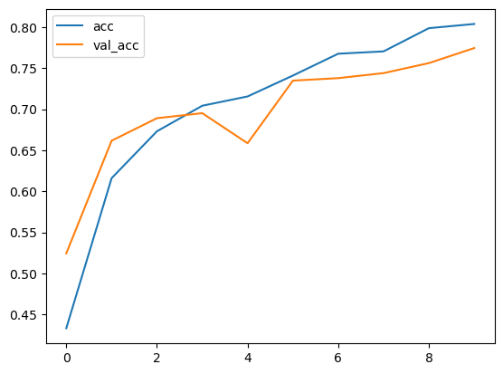
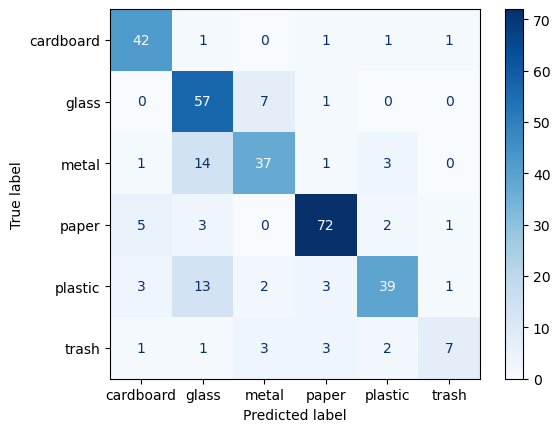

回到[我的报告](../my_report/my_report.md)


整体主要流程如下：

1. **数据加载和预处理**：从文件中读取图像路径和标签，进行预处理并生成数据流。
2. **模型构建**：使用预训练的VGG16模型，添加自定义的全连接层，构建分类模型。
3. **模型训练**：在训练数据上训练模型，并在验证数据上监控性能。
4. **模型评估**：在测试数据上评估模型性能，生成混淆矩阵和准确率。
5. **结果可视化**：可视化训练过程、预测结果和混淆矩阵。


## 1. 导入必要的库
```python
import numpy as np
import pandas as pd
import matplotlib.pyplot as plt
import re
import os
import random
from PIL import Image
import tensorflow as tf
from tensorflow.keras.preprocessing.image import ImageDataGenerator, load_img, img_to_array
from sklearn.metrics import accuracy_score, confusion_matrix, ConfusionMatrixDisplay
```
- **numpy** 和 **pandas**：用于数值计算和数据操作。
- **matplotlib**：用于绘图和可视化。
- **re** 和 **os**：用于处理正则表达式和文件路径。
- **PIL**：用于图像处理。
- **tensorflow** 和 **keras**：用于构建和训练深度学习模型。
- **sklearn.metrics**：用于评估模型性能（如准确率和混淆矩阵）。


# 一、数据加载和预处理

## 2. 定义辅助函数

```python
def add_class_name_prefix(df, col_name):
    df[col_name] = df[col_name].apply(lambda x: x[:re.search("\d",x).start()] + '/' + x)
    return df

def class_id_to_label(id):
    label_map = {1: 'glass', 2: 'paper', 3: 'cardboard', 4: 'plastic', 5: 'metal', 6: 'trash'}
    return label_map[id]
```
- **add_class_name_prefix**：这个函数的作用是将文件名中的类别名称作为前缀添加到路径中。例如，如果文件名是 `glass1.jpg`，函数会将其转换为 `glass/glass1.jpg`。
- **class_id_to_label**：这个函数将类别ID映射到类别名称。例如，ID `1` 对应 `glass`。


## 3. 加载数据

```python
IMAGES_DIR = '/kaggle/input/garbage-classification/Garbage classification/Garbage classification/'

# 分别存储训练、验证和测试集的文件路径和标签
train_file = '/kaggle/input/garbage-classification/one-indexed-files-notrash_train.txt'
val_file   = '/kaggle/input/garbage-classification/one-indexed-files-notrash_val.txt'
test_file  = '/kaggle/input/garbage-classification/one-indexed-files-notrash_test.txt'

# 读取CSV/txt文件，生成DataFrame
df_train = pd.read_csv(train_file, sep=' ', header=None, names=['path', 'label'])
df_valid = pd.read_csv(val_file,   sep=' ', header=None, names=['path', 'label'])
df_test  = pd.read_csv(val_file,   sep=' ', header=None, names=['path', 'label'])

# 为每个文件的路径添加类别前缀
df_train = add_class_name_prefix(df_train, 'path')
df_valid = add_class_name_prefix(df_valid, 'path')
df_test  = add_class_name_prefix(df_test,  'path')

# 将标签ID转换为类别名称
df_train['label'] = df_train['label'].apply(class_id_to_label)
df_valid['label'] = df_valid['label'].apply(class_id_to_label)
df_test['label']  = df_test['label'].apply(class_id_to_label)

# 输出数据集的大小
print(f'Found {len(df_train)} training, {len(df_valid)} validation and {len(df_test)} samples.')
```
```raw
Found 1768 training, 328 validation and 328 samples.
```

```raw
<>:3: SyntaxWarning: invalid escape sequence '\d'
<>:3: SyntaxWarning: invalid escape sequence '\d'
C:\Users\fangw\AppData\Local\Temp\ipykernel_11348\267473665.py:3: SyntaxWarning: invalid escape sequence '\d'
  df[col_name] = df[col_name].apply(lambda x: x[:re.search("\d",x).start()] + '/' + x)
```


## 4. 数据预处理

```python
# ImageDataGenerator: For data preprocessing
# flow_from_dataframe: Takes the Pandas DataFrame and the path to a directory and generates batches of augmented/normalized data
```

```python
# ImageDataGenerator用于图像数据增强和预处理。这里只进行了简单的归一化（将像素值缩放到0到1之间）
gen = ImageDataGenerator(rescale=1./255)    # rescaling the images between 0 and 1

gen_train = gen.flow_from_dataframe(
    dataframe=df_train,
    directory=IMAGES_DIR,
    x_col='path',
    y_col='label',
    color_mode="rgb",
    class_mode="categorical",
    batch_size=32,
    shuffle=True
)

gen_valid = gen.flow_from_dataframe(
    dataframe=df_valid,
    directory=IMAGES_DIR,
    x_col='path',
    y_col='label',
    color_mode="rgb",
    class_mode="categorical",
    batch_size=32,
    shuffle=True
)
# flow_from_dataframe：从DataFrame中读取图像数据，生成批量数据流
test_gen = gen.flow_from_dataframe(
    dataframe=df_test, # 包含图像路径和标签的DataFrame
    directory=IMAGES_DIR, # 图像所在的目
    x_col='path', # 指定图像路径
    y_col='label', # 指定标签的列名
    color_mode="rgb", # 图像颜色模式（这里是RGB）
    class_mode="categorical", #标签的类型（这里是多分类，使用one-hot编码）
    batch_size=32, # 每个批次的样本数
    shuffle=False # 是否打乱数据顺序
)
```
```raw
Found 1768 validated image filenames belonging to 6 classes.
Found 328 validated image filenames belonging to 6 classes.
Found 328 validated image filenames belonging to 6 classes.
```


# 二、模型构建

## 5. 构建模型

```python
# 构建模型的函数
def build_model(num_classes):
    # 使用预训练的VGG16模型（不包括顶部的全连接层）
    base_model = tf.keras.applications.VGG16(weights='imagenet', include_top=False)
    x = base_model.output
    x = tf.keras.layers.GlobalAveragePooling2D()(x) # 将特征图转换为向量
    x = tf.keras.layers.Dense(1024, activation='relu')(x) # 添加全连接层，输出类别概率
    predictions = tf.keras.layers.Dense(num_classes, activation='softmax')(x) # 用于多分类问题的激活函数
    model = tf.keras.Model(inputs=base_model.input, outputs=predictions)
    base_model.trainable = False # 冻结预训练模型的权重，只训练新添加的层
    return model

model = build_model(num_classes=6)
# 编译模型，指定优化器、损失函数和评估指标
model.compile(optimizer='Adam',
              loss='categorical_crossentropy',
              metrics=[tf.keras.metrics.categorical_accuracy])

model.summary() # 输出模型的结构信息
```
<pre style="white-space:pre;overflow-x:auto;line-height:normal;font-family:Menlo,'DejaVu Sans Mono',consolas,'Courier New',monospace"><span style="font-weight: bold">Model: "functional"</span>
</pre>
<pre style="white-space:pre;overflow-x:auto;line-height:normal;font-family:Menlo,'DejaVu Sans Mono',consolas,'Courier New',monospace">┏━━━━━━━━━━━━━━━━━━━━━━━━━━━━━━━━━━━━━━┳━━━━━━━━━━━━━━━━━━━━━━━━━━━━━┳━━━━━━━━━━━━━━━━━┓
┃<span style="font-weight: bold"> Layer (type)                         </span>┃<span style="font-weight: bold"> Output Shape                </span>┃<span style="font-weight: bold">         Param # </span>┃
┡━━━━━━━━━━━━━━━━━━━━━━━━━━━━━━━━━━━━━━╇━━━━━━━━━━━━━━━━━━━━━━━━━━━━━╇━━━━━━━━━━━━━━━━━┩
│ input_layer (<span style="color: #0087ff; text-decoration-color: #0087ff">InputLayer</span>)             │ (<span style="color: #00d7ff; text-decoration-color: #00d7ff">None</span>, <span style="color: #00d7ff; text-decoration-color: #00d7ff">None</span>, <span style="color: #00d7ff; text-decoration-color: #00d7ff">None</span>, <span style="color: #00af00; text-decoration-color: #00af00">3</span>)       │               <span style="color: #00af00; text-decoration-color: #00af00">0</span> │
├──────────────────────────────────────┼─────────────────────────────┼─────────────────┤
│ block1_conv1 (<span style="color: #0087ff; text-decoration-color: #0087ff">Conv2D</span>)                │ (<span style="color: #00d7ff; text-decoration-color: #00d7ff">None</span>, <span style="color: #00d7ff; text-decoration-color: #00d7ff">None</span>, <span style="color: #00d7ff; text-decoration-color: #00d7ff">None</span>, <span style="color: #00af00; text-decoration-color: #00af00">64</span>)      │           <span style="color: #00af00; text-decoration-color: #00af00">1,792</span> │
├──────────────────────────────────────┼─────────────────────────────┼─────────────────┤
│ block1_conv2 (<span style="color: #0087ff; text-decoration-color: #0087ff">Conv2D</span>)                │ (<span style="color: #00d7ff; text-decoration-color: #00d7ff">None</span>, <span style="color: #00d7ff; text-decoration-color: #00d7ff">None</span>, <span style="color: #00d7ff; text-decoration-color: #00d7ff">None</span>, <span style="color: #00af00; text-decoration-color: #00af00">64</span>)      │          <span style="color: #00af00; text-decoration-color: #00af00">36,928</span> │
├──────────────────────────────────────┼─────────────────────────────┼─────────────────┤
│ block1_pool (<span style="color: #0087ff; text-decoration-color: #0087ff">MaxPooling2D</span>)           │ (<span style="color: #00d7ff; text-decoration-color: #00d7ff">None</span>, <span style="color: #00d7ff; text-decoration-color: #00d7ff">None</span>, <span style="color: #00d7ff; text-decoration-color: #00d7ff">None</span>, <span style="color: #00af00; text-decoration-color: #00af00">64</span>)      │               <span style="color: #00af00; text-decoration-color: #00af00">0</span> │
├──────────────────────────────────────┼─────────────────────────────┼─────────────────┤
│ block2_conv1 (<span style="color: #0087ff; text-decoration-color: #0087ff">Conv2D</span>)                │ (<span style="color: #00d7ff; text-decoration-color: #00d7ff">None</span>, <span style="color: #00d7ff; text-decoration-color: #00d7ff">None</span>, <span style="color: #00d7ff; text-decoration-color: #00d7ff">None</span>, <span style="color: #00af00; text-decoration-color: #00af00">128</span>)     │          <span style="color: #00af00; text-decoration-color: #00af00">73,856</span> │
├──────────────────────────────────────┼─────────────────────────────┼─────────────────┤
│ block2_conv2 (<span style="color: #0087ff; text-decoration-color: #0087ff">Conv2D</span>)                │ (<span style="color: #00d7ff; text-decoration-color: #00d7ff">None</span>, <span style="color: #00d7ff; text-decoration-color: #00d7ff">None</span>, <span style="color: #00d7ff; text-decoration-color: #00d7ff">None</span>, <span style="color: #00af00; text-decoration-color: #00af00">128</span>)     │         <span style="color: #00af00; text-decoration-color: #00af00">147,584</span> │
├──────────────────────────────────────┼─────────────────────────────┼─────────────────┤
│ block2_pool (<span style="color: #0087ff; text-decoration-color: #0087ff">MaxPooling2D</span>)           │ (<span style="color: #00d7ff; text-decoration-color: #00d7ff">None</span>, <span style="color: #00d7ff; text-decoration-color: #00d7ff">None</span>, <span style="color: #00d7ff; text-decoration-color: #00d7ff">None</span>, <span style="color: #00af00; text-decoration-color: #00af00">128</span>)     │               <span style="color: #00af00; text-decoration-color: #00af00">0</span> │
├──────────────────────────────────────┼─────────────────────────────┼─────────────────┤
│ block3_conv1 (<span style="color: #0087ff; text-decoration-color: #0087ff">Conv2D</span>)                │ (<span style="color: #00d7ff; text-decoration-color: #00d7ff">None</span>, <span style="color: #00d7ff; text-decoration-color: #00d7ff">None</span>, <span style="color: #00d7ff; text-decoration-color: #00d7ff">None</span>, <span style="color: #00af00; text-decoration-color: #00af00">256</span>)     │         <span style="color: #00af00; text-decoration-color: #00af00">295,168</span> │
├──────────────────────────────────────┼─────────────────────────────┼─────────────────┤
│ block3_conv2 (<span style="color: #0087ff; text-decoration-color: #0087ff">Conv2D</span>)                │ (<span style="color: #00d7ff; text-decoration-color: #00d7ff">None</span>, <span style="color: #00d7ff; text-decoration-color: #00d7ff">None</span>, <span style="color: #00d7ff; text-decoration-color: #00d7ff">None</span>, <span style="color: #00af00; text-decoration-color: #00af00">256</span>)     │         <span style="color: #00af00; text-decoration-color: #00af00">590,080</span> │
├──────────────────────────────────────┼─────────────────────────────┼─────────────────┤
│ block3_conv3 (<span style="color: #0087ff; text-decoration-color: #0087ff">Conv2D</span>)                │ (<span style="color: #00d7ff; text-decoration-color: #00d7ff">None</span>, <span style="color: #00d7ff; text-decoration-color: #00d7ff">None</span>, <span style="color: #00d7ff; text-decoration-color: #00d7ff">None</span>, <span style="color: #00af00; text-decoration-color: #00af00">256</span>)     │         <span style="color: #00af00; text-decoration-color: #00af00">590,080</span> │
├──────────────────────────────────────┼─────────────────────────────┼─────────────────┤
│ block3_pool (<span style="color: #0087ff; text-decoration-color: #0087ff">MaxPooling2D</span>)           │ (<span style="color: #00d7ff; text-decoration-color: #00d7ff">None</span>, <span style="color: #00d7ff; text-decoration-color: #00d7ff">None</span>, <span style="color: #00d7ff; text-decoration-color: #00d7ff">None</span>, <span style="color: #00af00; text-decoration-color: #00af00">256</span>)     │               <span style="color: #00af00; text-decoration-color: #00af00">0</span> │
├──────────────────────────────────────┼─────────────────────────────┼─────────────────┤
│ block4_conv1 (<span style="color: #0087ff; text-decoration-color: #0087ff">Conv2D</span>)                │ (<span style="color: #00d7ff; text-decoration-color: #00d7ff">None</span>, <span style="color: #00d7ff; text-decoration-color: #00d7ff">None</span>, <span style="color: #00d7ff; text-decoration-color: #00d7ff">None</span>, <span style="color: #00af00; text-decoration-color: #00af00">512</span>)     │       <span style="color: #00af00; text-decoration-color: #00af00">1,180,160</span> │
├──────────────────────────────────────┼─────────────────────────────┼─────────────────┤
│ block4_conv2 (<span style="color: #0087ff; text-decoration-color: #0087ff">Conv2D</span>)                │ (<span style="color: #00d7ff; text-decoration-color: #00d7ff">None</span>, <span style="color: #00d7ff; text-decoration-color: #00d7ff">None</span>, <span style="color: #00d7ff; text-decoration-color: #00d7ff">None</span>, <span style="color: #00af00; text-decoration-color: #00af00">512</span>)     │       <span style="color: #00af00; text-decoration-color: #00af00">2,359,808</span> │
├──────────────────────────────────────┼─────────────────────────────┼─────────────────┤
│ block4_conv3 (<span style="color: #0087ff; text-decoration-color: #0087ff">Conv2D</span>)                │ (<span style="color: #00d7ff; text-decoration-color: #00d7ff">None</span>, <span style="color: #00d7ff; text-decoration-color: #00d7ff">None</span>, <span style="color: #00d7ff; text-decoration-color: #00d7ff">None</span>, <span style="color: #00af00; text-decoration-color: #00af00">512</span>)     │       <span style="color: #00af00; text-decoration-color: #00af00">2,359,808</span> │
├──────────────────────────────────────┼─────────────────────────────┼─────────────────┤
│ block4_pool (<span style="color: #0087ff; text-decoration-color: #0087ff">MaxPooling2D</span>)           │ (<span style="color: #00d7ff; text-decoration-color: #00d7ff">None</span>, <span style="color: #00d7ff; text-decoration-color: #00d7ff">None</span>, <span style="color: #00d7ff; text-decoration-color: #00d7ff">None</span>, <span style="color: #00af00; text-decoration-color: #00af00">512</span>)     │               <span style="color: #00af00; text-decoration-color: #00af00">0</span> │
├──────────────────────────────────────┼─────────────────────────────┼─────────────────┤
│ block5_conv1 (<span style="color: #0087ff; text-decoration-color: #0087ff">Conv2D</span>)                │ (<span style="color: #00d7ff; text-decoration-color: #00d7ff">None</span>, <span style="color: #00d7ff; text-decoration-color: #00d7ff">None</span>, <span style="color: #00d7ff; text-decoration-color: #00d7ff">None</span>, <span style="color: #00af00; text-decoration-color: #00af00">512</span>)     │       <span style="color: #00af00; text-decoration-color: #00af00">2,359,808</span> │
├──────────────────────────────────────┼─────────────────────────────┼─────────────────┤
│ block5_conv2 (<span style="color: #0087ff; text-decoration-color: #0087ff">Conv2D</span>)                │ (<span style="color: #00d7ff; text-decoration-color: #00d7ff">None</span>, <span style="color: #00d7ff; text-decoration-color: #00d7ff">None</span>, <span style="color: #00d7ff; text-decoration-color: #00d7ff">None</span>, <span style="color: #00af00; text-decoration-color: #00af00">512</span>)     │       <span style="color: #00af00; text-decoration-color: #00af00">2,359,808</span> │
├──────────────────────────────────────┼─────────────────────────────┼─────────────────┤
│ block5_conv3 (<span style="color: #0087ff; text-decoration-color: #0087ff">Conv2D</span>)                │ (<span style="color: #00d7ff; text-decoration-color: #00d7ff">None</span>, <span style="color: #00d7ff; text-decoration-color: #00d7ff">None</span>, <span style="color: #00d7ff; text-decoration-color: #00d7ff">None</span>, <span style="color: #00af00; text-decoration-color: #00af00">512</span>)     │       <span style="color: #00af00; text-decoration-color: #00af00">2,359,808</span> │
├──────────────────────────────────────┼─────────────────────────────┼─────────────────┤
│ block5_pool (<span style="color: #0087ff; text-decoration-color: #0087ff">MaxPooling2D</span>)           │ (<span style="color: #00d7ff; text-decoration-color: #00d7ff">None</span>, <span style="color: #00d7ff; text-decoration-color: #00d7ff">None</span>, <span style="color: #00d7ff; text-decoration-color: #00d7ff">None</span>, <span style="color: #00af00; text-decoration-color: #00af00">512</span>)     │               <span style="color: #00af00; text-decoration-color: #00af00">0</span> │
├──────────────────────────────────────┼─────────────────────────────┼─────────────────┤
│ global_average_pooling2d             │ (<span style="color: #00d7ff; text-decoration-color: #00d7ff">None</span>, <span style="color: #00af00; text-decoration-color: #00af00">512</span>)                 │               <span style="color: #00af00; text-decoration-color: #00af00">0</span> │
│ (<span style="color: #0087ff; text-decoration-color: #0087ff">GlobalAveragePooling2D</span>)             │                             │                 │
├──────────────────────────────────────┼─────────────────────────────┼─────────────────┤
│ dense (<span style="color: #0087ff; text-decoration-color: #0087ff">Dense</span>)                        │ (<span style="color: #00d7ff; text-decoration-color: #00d7ff">None</span>, <span style="color: #00af00; text-decoration-color: #00af00">1024</span>)                │         <span style="color: #00af00; text-decoration-color: #00af00">525,312</span> │
├──────────────────────────────────────┼─────────────────────────────┼─────────────────┤
│ dense_1 (<span style="color: #0087ff; text-decoration-color: #0087ff">Dense</span>)                      │ (<span style="color: #00d7ff; text-decoration-color: #00d7ff">None</span>, <span style="color: #00af00; text-decoration-color: #00af00">6</span>)                   │           <span style="color: #00af00; text-decoration-color: #00af00">6,150</span> │
└──────────────────────────────────────┴─────────────────────────────┴─────────────────┘
</pre>
<pre style="white-space:pre;overflow-x:auto;line-height:normal;font-family:Menlo,'DejaVu Sans Mono',consolas,'Courier New',monospace"><span style="font-weight: bold"> Total params: </span><span style="color: #00af00; text-decoration-color: #00af00">15,246,150</span> (58.16 MB)
</pre>
<pre style="white-space:pre;overflow-x:auto;line-height:normal;font-family:Menlo,'DejaVu Sans Mono',consolas,'Courier New',monospace"><span style="font-weight: bold"> Trainable params: </span><span style="color: #00af00; text-decoration-color: #00af00">531,462</span> (2.03 MB)
</pre>
<pre style="white-space:pre;overflow-x:auto;line-height:normal;font-family:Menlo,'DejaVu Sans Mono',consolas,'Courier New',monospace"><span style="font-weight: bold"> Non-trainable params: </span><span style="color: #00af00; text-decoration-color: #00af00">14,714,688</span> (56.13 MB)
</pre>


# 三、模型训练

## 6. 训练模型

```python
history = model.fit(
    gen_train, # 训练数据生成器
    validation_data=gen_valid, # 验证数据生成器
    epochs=10 # 训练的轮数
)
```
```raw
Epoch 1/10
C:\Users\fangw\AppData\Roaming\Python\Python312\site-packages\keras\src\trainers\data_adapters\py_dataset_adapter.py:121: UserWarning: Your `PyDataset` class should call `super().__init__(**kwargs)` in its constructor. `**kwargs` can include `workers`, `use_multiprocessing`, `max_queue_size`. Do not pass these arguments to `fit()`, as they will be ignored.
  self._warn_if_super_not_called()
56/56 ━━━━━━━━━━━━━━━━━━━━ 170s 3s/step - categorical_accuracy: 0.3388 - loss: 1.5526 - val_categorical_accuracy: 0.5244 - val_loss: 1.1588
Epoch 2/10
56/56 ━━━━━━━━━━━━━━━━━━━━ 175s 3s/step - categorical_accuracy: 0.6056 - loss: 1.0544 - val_categorical_accuracy: 0.6616 - val_loss: 0.9655
Epoch 3/10
56/56 ━━━━━━━━━━━━━━━━━━━━ 176s 3s/step - categorical_accuracy: 0.6727 - loss: 0.9155 - val_categorical_accuracy: 0.6890 - val_loss: 0.8617
Epoch 4/10
56/56 ━━━━━━━━━━━━━━━━━━━━ 170s 3s/step - categorical_accuracy: 0.6952 - loss: 0.8358 - val_categorical_accuracy: 0.6951 - val_loss: 0.8224
Epoch 5/10
56/56 ━━━━━━━━━━━━━━━━━━━━ 171s 3s/step - categorical_accuracy: 0.7316 - loss: 0.7353 - val_categorical_accuracy: 0.6585 - val_loss: 0.8817
Epoch 6/10
56/56 ━━━━━━━━━━━━━━━━━━━━ 172s 3s/step - categorical_accuracy: 0.7475 - loss: 0.6965 - val_categorical_accuracy: 0.7348 - val_loss: 0.7548
Epoch 7/10
56/56 ━━━━━━━━━━━━━━━━━━━━ 182s 3s/step - categorical_accuracy: 0.7721 - loss: 0.6442 - val_categorical_accuracy: 0.7378 - val_loss: 0.7189
Epoch 8/10
56/56 ━━━━━━━━━━━━━━━━━━━━ 174s 3s/step - categorical_accuracy: 0.7737 - loss: 0.6694 - val_categorical_accuracy: 0.7439 - val_loss: 0.6928
Epoch 9/10
56/56 ━━━━━━━━━━━━━━━━━━━━ 167s 3s/step - categorical_accuracy: 0.7877 - loss: 0.6128 - val_categorical_accuracy: 0.7561 - val_loss: 0.7074
Epoch 10/10
56/56 ━━━━━━━━━━━━━━━━━━━━ 166s 3s/step - categorical_accuracy: 0.7961 - loss: 0.5665 - val_categorical_accuracy: 0.7744 - val_loss: 0.6652
```


## 7. 可视化训练过程
```python
# 绘制训练和验证的损失和准确率曲线
plt.plot(history.history['loss'], label='loss')
plt.plot(history.history['val_loss'], label='val_loss')
plt.legend() # 添加图例
plt.show()
```


```python
plt.plot(history.history['categorical_accuracy'], label='acc')
plt.plot(history.history['val_categorical_accuracy'], label='val_acc')
plt.legend() # 添加图例
plt.show()
```




# 四、模型评估

## 8. 评估模型

```python
filenames = test_gen.filenames
nb_samples = len(filenames)

model.evaluate(test_gen, nb_samples) # 在测试集上评估模型性能
```
```raw
328/328 ━━━━━━━━━━━━━━━━━━━━ 26s 70ms/step - categorical_accuracy: 0.7754 - loss: 0.6644
```

```raw
C:\Users\fangw\AppData\Roaming\Python\Python312\site-packages\keras\src\trainers\epoch_iterator.py:107: UserWarning: Your input ran out of data; interrupting training. Make sure that your dataset or generator can generate at least `steps_per_epoch * epochs` batches. You may need to use the `.repeat()` function when building your dataset.
  self._interrupted_warning()
```

```raw
[0.6651769280433655, 0.7743902206420898]
```


# 五、结果可视化

## 9. 生成预测并可视化结果

```python
# Generating predictions on test data
test_x, test_y = test_gen.__getitem__(1) # 获取一个批次的测试数据
preds = model.predict(test_x) # 生成预测结果
```

```raw
1/1 ━━━━━━━━━━━━━━━━━━━━ 3s 3s/step
```


```python
# Comparing predcitons with original labels
labels = (gen_train.class_indices)
labels = dict((v,k) for k,v in labels.items())
plt.figure(figsize=(16, 16))
for i in range(16):
    plt.subplot(4, 4, i+1)
    plt.xticks([])
    plt.yticks([])
    plt.grid(False)
    plt.title('pred:%s / truth:%s' % (labels[np.argmax(preds[i])], labels[np.argmax(test_y[i])]))
    plt.imshow(test_x[i])
```


- **plt.subplot** 和 **plt.imshow**：可视化预测结果和真实标签。

## 10. 混淆矩阵和准确率
```python
y_pred = model.predict(test_gen)
y_pred = np.argmax(y_pred, axis=1)
print('Confusion Matrix')
cm = confusion_matrix(test_gen.classes, y_pred) # 计算混淆矩阵
labels = ['cardboard', 'glass', 'metal', 'paper', 'plastic', 'trash']
# 可视化混淆矩阵
disp = ConfusionMatrixDisplay(confusion_matrix=cm, display_labels=labels)
disp.plot(cmap=plt.cm.Blues)
plt.show()
```
```raw
11/11 ━━━━━━━━━━━━━━━━━━━━ 27s 2s/step
Confusion Matrix
```



```python
# Accuracy

acc = accuracy_score(test_gen.classes, y_pred) # 计算准确率
print("Accuracy is {} percent".format(round(acc*100,2)))
```

```raw
Accuracy is 77.44 percent
```

## 11. 保存模型

```python
model.save("model_vgg16.keras")
print("saved!")
```

```raw
saved!
```


# 六、预测推理inference

## 后端flask

```python
# src/app.py
import os
import time  # 用于计算预测时间
import numpy as np
import tensorflow as tf
from flask import Flask, request, jsonify, render_template
from werkzeug.utils import secure_filename
from tensorflow.keras.preprocessing.image import load_img, img_to_array

# 初始化 Flask 应用
app = Flask(__name__)

# 设置上传文件夹
UPLOAD_FOLDER = 'uploads'
app.config['UPLOAD_FOLDER'] = UPLOAD_FOLDER

# 确保上传目录存在
if not os.path.exists(UPLOAD_FOLDER):
    os.makedirs(UPLOAD_FOLDER)

# 载入训练好的模型
MODEL_PATH = "model_vgg16.keras"  # 我的模型路径
# 载入模型，不加载优化器
model = tf.keras.models.load_model(MODEL_PATH, compile=False)
# 重新编译模型
model.compile(optimizer='adam', loss='categorical_crossentropy', metrics=['accuracy'])


# 定义类别标签
class_labels = ['cardboard', 'glass', 'metal', 'paper', 'plastic', 'trash']

# 处理图片上传并进行预测
@app.route('/', methods=['GET', 'POST'])
def upload_file():
    if request.method == 'POST':
        file = request.files['file']
        if file:
            filename = secure_filename(file.filename)
            filepath = os.path.join(app.config['UPLOAD_FOLDER'], filename)
            file.save(filepath)
            
            # 读取图片并预处理
            img = load_img(filepath, target_size=(224, 224))
            img_array = img_to_array(img) / 255.0
            img_array = np.expand_dims(img_array, axis=0)
            
            # 记录开始时间
            start_time = time.time()
            predictions = model.predict(img_array)
            end_time = time.time()  # 记录结束时间

            # 计算预测时间（毫秒）
            prediction_time = round((end_time - start_time) * 1000, 2)

            predicted_class = class_labels[np.argmax(predictions)]
            confidence = round(100 * np.max(predictions), 2)
            
            return jsonify({'class': predicted_class, 'confidence': confidence, 'time': prediction_time})
    
    return render_template('index.html')

if __name__ == '__main__':
    app.run(debug=True)
```


## 前端

```HTML
<!--   src/templates/index.html   -->


<!DOCTYPE html>
<html lang="zh">
<head>
    <meta charset="UTF-8">
    <meta name="viewport" content="width=device-width, initial-scale=1.0">
    <title>垃圾分类预测</title>
    <style>
        /* 页面全局居中 */
        body {
            display: flex;
            flex-direction: column;
            justify-content: center;
            align-items: center;
            height: 100vh;
            text-align: center;
            font-family: Arial, sans-serif;
        }

        /* 预览区域样式 */
        #preview {
            margin-top: 20px;
            display: none;
        }

        #preview img {
            max-width: 300px;
            border: 2px solid #ddd;
            border-radius: 10px;
            padding: 5px;
        }

        /* 上传按钮样式 */
        button {
            margin-top: 10px;
            padding: 10px 15px;
            font-size: 16px;
            cursor: pointer;
            background-color: #4CAF50;
            color: white;
            border: none;
            border-radius: 5px;
        }

        button:hover {
            background-color: #45a049;
        }
    </style>
</head>
<body>
    <h2>上传图片进行垃圾分类</h2>
    <form id="uploadForm" action="/" method="post" enctype="multipart/form-data">
        <input type="file" name="file" id="fileInput" required>
        <button type="submit">上传并预测</button>
    </form>

    <div id="preview">
        <h3>图片预览</h3>
        
        <div id="result"></div>
    </div>

    <script>
        document.getElementById("fileInput").onchange = function(event) {
            let file = event.target.files[0];
            let previewImage = document.getElementById("previewImage");
            let previewDiv = document.getElementById("preview");
            let resultDiv = document.getElementById("result");

            if (file) {
                let reader = new FileReader();
                reader.onload = function(e) {
                    previewImage.src = e.target.result;
                    previewDiv.style.display = "block";
                    resultDiv.innerHTML = ""; // 清空上次的预测结果
                };
                reader.readAsDataURL(file);
            } else {
                previewDiv.style.display = "none";
                resultDiv.innerHTML = "";
            }
        };

        document.getElementById("uploadForm").onsubmit = async function(event) {
            event.preventDefault();

            let formData = new FormData(this);
            let response = await fetch("/", { method: "POST", body: formData });
            let result = await response.json();

            document.getElementById("result").innerHTML = `
                <h3>预测类别: ${result.class}</h3>
                <p>置信度: ${result.confidence}%</p>
                <p>预测所用时间: ${result.time} 毫秒</p>
            `;
        };
    </script>
</body>
</html>

```

