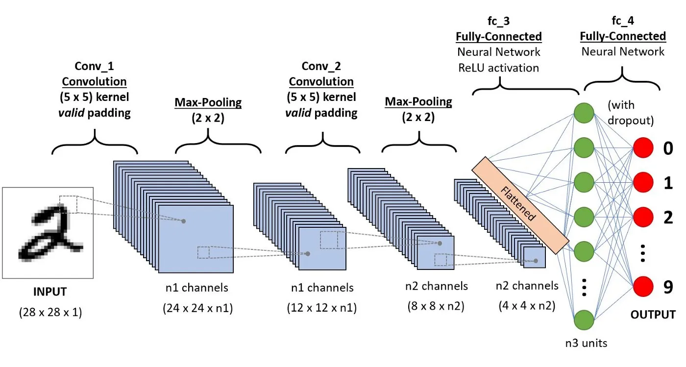
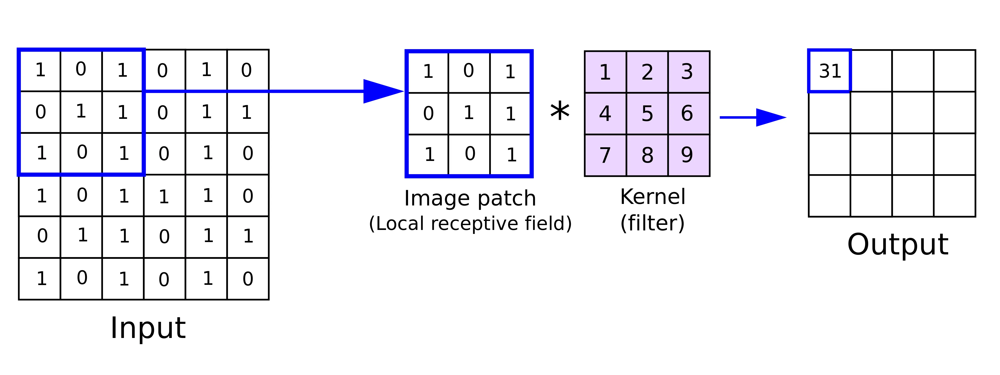
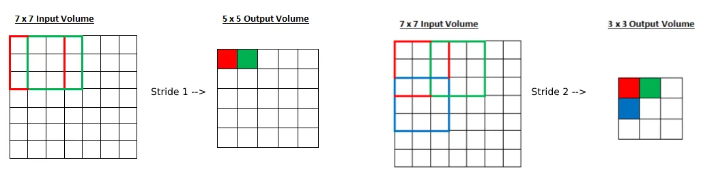
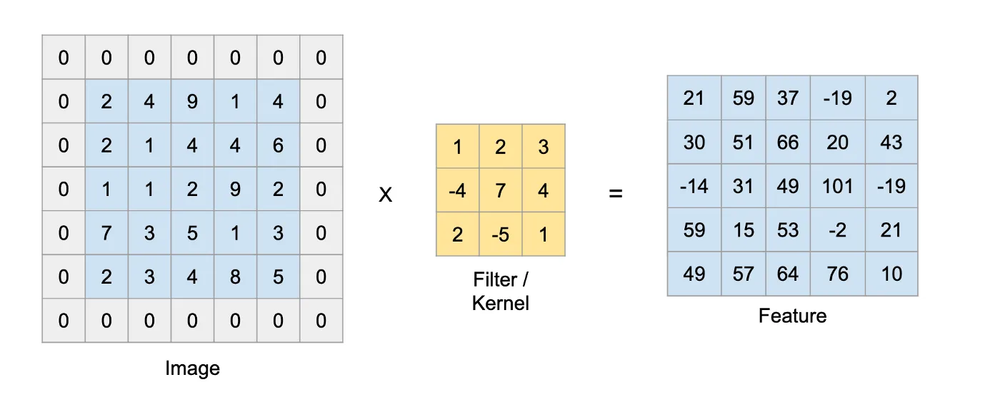
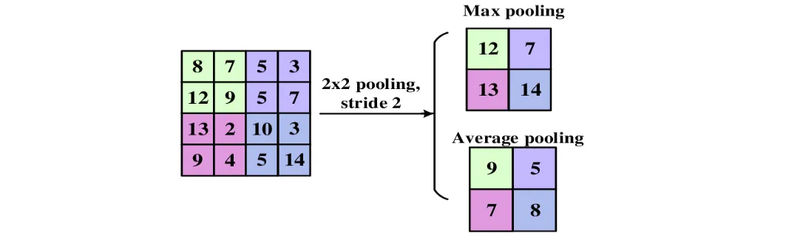
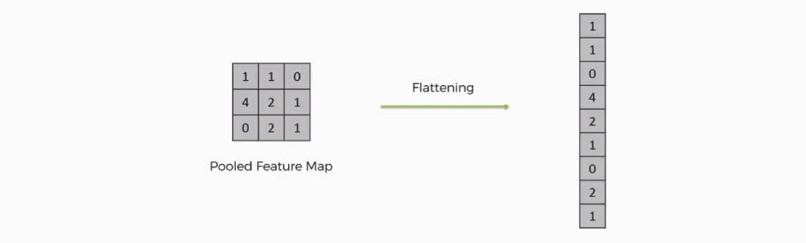
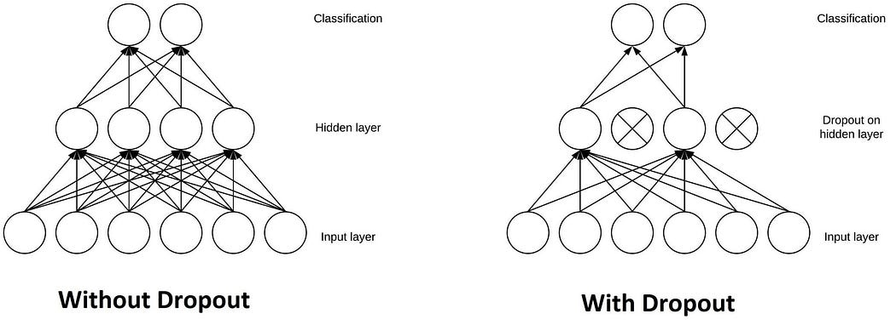

# [Introduction to Convolution Neural Network](https://www.geeksforgeeks.org/introduction-convolution-neural-network/)

这篇也讲得不错

# [Convolutional Neural Network (CNN) in Machine Learning](https://www.geeksforgeeks.org/convolutional-neural-network-cnn-in-machine-learning/)

**Convolutional Neural Networks (CNNs)** are a specialized class of neural networks designed to process grid-like data, such as images. They are particularly well-suited for image recognition and processing tasks. 一种专门的神经网络，用于处理网格状的数据，如图像。它们特别适合图像识别和处理任务

They are inspired by the visual processing mechanisms in the human brain, CNNs excel at capturing <u>hierarchical patterns and spatial dependencies</u> within images.

## Key Components of a CNN

1. [**Convolutional Layers**](https://www.geeksforgeeks.org/what-are-convolution-layers/)**:** These layers apply convolutional operations to input images, using filters (also known as kernels) to detect features such as edges, textures, and more complex patterns. Convolutional operations help preserve the spatial relationships between pixels. 这些层将卷积操作应用于输入图像，使用过滤器（也称为核）来检测边缘、纹理和更复杂的图案等特征。卷积运算有助于保持像素之间的空间关系。
2. [**Pooling Layers**](https://www.geeksforgeeks.org/cnn-introduction-to-pooling-layer/)**:** They downsample the spatial dimensions of the input, reducing the <u>computational complexity计算复杂度</u> and the number of parameters in the network. Max pooling最大池化 is a common pooling operation, selecting the maximum value from a group of neighboring pixels. 降低了输入的空间维度，降低了计算复杂度和网络中参数的数量。最大池化是一种常见的池化操作，从一组相邻像素中选择最大值。
3. [**Activation Functions**](https://www.geeksforgeeks.org/activation-functions/)**:** They introduce non-linearity to the model, allowing it to learn more complex relationships in the data. 他们将非线性引入模型，使其能够学习数据中更复杂的关系。
4. [**Fully Connected Layers**](https://www.geeksforgeeks.org/what-is-fully-connected-layer-in-deep-learning/)**:** These layers are responsible for making predictions based on the high-level features learned by the previous layers. They connect every neuron in one layer to every neuron in the next layer. 这些层负责根据前一层学习到的高级特征进行预测。它们将这一层的每个神经元连接到下一层的每个神经元。

## How CNNs Work?

1. **Input Image**: The CNN receives an input image, which is typically preprocessed to ensure uniformity in size and format.
2. **Convolutional Layers**: Filters are applied to the input image to extract features like edges, textures, and shapes.
3. **Pooling Layers**: The feature maps generated by the convolutional layers are downsampled to reduce dimensionality.
4. **Fully Connected Layers**: The downsampled feature maps are passed through fully connected layers to produce the final output, such as a classification label.
5. **Output**: The CNN outputs a prediction, such as the class of the image.

## **Convolutional Neural Network Training**

CNNs are trained using a supervised learning approach. This means that the CNN is given a set of labeled training images. The CNN then learns to map the input images to their correct labels.

The training process for a CNN involves the following steps:

1. **Data Preparation:** The training images are preprocessed to ensure that they are all in the same format and size.
2. **Loss Function:** A loss function is used to measure how well the CNN is performing on the training data. The loss function is typically calculated by taking the difference between the predicted labels and the actual labels of the training images.
3. **Optimizer:** An optimizer is used to update the weights of the CNN in order to minimize the loss function.
4. **Backpropagation:** Backpropagation is a technique used to calculate the gradients of the loss function with respect to the weights of the CNN. The gradients are then used to update the weights of the CNN using the optimizer.

## **CNN Evaluation**

After training, CNN can be evaluated on a held-out test set. A collection of pictures that the CNN has not seen during training makes up the test set. How well the CNN performs on the test set is a good predictor of how well it will function on actual data.

The efficiency of a CNN on picture categorization tasks can be evaluated using a variety of criteria. Among the most popular metrics are:

- **Accuracy:** Accuracy is the percentage of test images that the CNN correctly classifies.
- **Precision:** Precision is the percentage of test images that the CNN predicts as a particular class and that are actually of that class.
- **Recall:** Recall is the percentage of test images that are of a particular class and that the CNN predicts as that class.
- **F1 Score:** The F1 Score is a harmonic mean of precision and recall. It is a good metric for evaluating the performance of a CNN on classes that are imbalanced.

## **Different Types of CNN Models**

### 1.LeNet

[LeNet](https://www.geeksforgeeks.org/what-is-lenet/), developed by Yann LeCun and his colleagues in the late 1990s, was one of the first successful CNNs designed for handwritten digit recognition. It laid the foundation for modern CNNs and achieved high accuracy on the MNIST dataset, which contains 70,000 images of handwritten digits (0-9).

### 2.AlexNet

[AlexNet](https://www.geeksforgeeks.org/ml-getting-started-with-alexnet/) is a CNN architecture that was developed by Alex Krizhevsky, Ilya Sutskever, and Geoffrey Hinton in 2012. It was the first CNN to win the ImageNet Large Scale Visual Recognition Challenge (ILSVRC), a major image recognition competition, and it helped to establish CNNs as a powerful tool for image recognition.

AlexNet consists of several layers of convolutional and pooling layers, followed by fully connected layers. The architecture includes five convolutional layers, three pooling layers, and three fully connected layers.

### 3. Resnet

[ResNets (Residual Networks)](https://www.geeksforgeeks.org/residual-networks-resnet-deep-learning/) are designed for image recognition and processing tasks. They are renowned for their ability to train very deep networks without overfitting, making them highly effective for complex tasks.

It introduces skip connections that allow the network to learn residual functions making it easier to train deep architecture.

### 4.**GoogleNet**

[GoogleNet](https://www.geeksforgeeks.org/understanding-googlenet-model-cnn-architecture/), also known as InceptionNet, is renowned for achieving high accuracy in image classification while using fewer parameters and computational resources compared to other state-of-the-art CNNs.

The core component of GoogleNet, Inception modules allow the network to learn features at different scales simultaneously, enhancing performance.

### **5. VGG**

[VGGs](https://www.geeksforgeeks.org/vgg-net-architecture-explained/) are developed by the Visual Geometry Group at Oxford, it uses small 3×3 convolutional filters stacked in multiple layers, creating a deep and uniform structure. Popular variants like VGG-16 and VGG-19 achieved state-of-the-art performance on the ImageNet dataset, demonstrating the power of depth in CNNs.

## **Applications of CNN**

- **Image classification:** CNNs are the state-of-the-art models for image classification. They can be used to classify images into different categories, such as cats and dogs, cars and trucks, and flowers and animals.
- **Object detection:** CNNs can be used to detect objects in images, such as people, cars, and buildings. They can also be used to localize objects in images, which means that they can identify the location of an object in an image.
- **Image segmentation:** CNNs can be used to segment images, which means that they can identify and label different objects in an image. This is useful for applications such as medical imaging and robotics.
- **Video analysis:** CNNs can be used to analyze videos, such as tracking objects in a video or detecting events in a video. This is useful for applications such as video surveillance and traffic monitoring.

## **Advantages of CNN**

- **High Accuracy**: CNNs achieve state-of-the-art最牛逼 accuracy in various image recognition tasks.
- **Efficiency**: CNNs are efficient, especially when implemented on GPUs.
- **Robustness**: CNNs are robust to noise and variations in input data.
- **Adaptability**: CNNs can be adapted to different tasks by modifying their architecture.

## **Disadvantages of CNN**

- **Complexity**: CNNs can be complex and difficult to train, especially for large datasets.
- **Resource-Intensive**: CNNs require significant computational resources for training and deployment.
- **Data Requirements**: CNNs need large amounts of labeled data for training.
- **Interpretability**: CNNs can be difficult to interpret, making it challenging to understand their predictions.

## **Case Study of CNN for Diabetic retinopathy**

- Diabetic retinopathy also known as diabetic eye disease, is a medical state in which destruction occurs to the retina due to diabetes mellitus, It is a major cause of blindness in advance countries.
- Diabetic retinopathy influence up to 80 percent of those who have had diabetes for 20 years or more.
- The overlong a person has diabetes, the higher his or her chances of growing diabetic retinopathy.
- It is also the main cause of blindness in people of age group 20-64.
- Diabetic retinopathy is the outcome of destruction to the small blood vessels and neurons of the retina.

# [Convolutional Neural Networks (CNN) — Architecture Explained](https://medium.com/@draj0718/convolutional-neural-networks-cnn-architectures-explained-716fb197b243#id_token=eyJhbGciOiJSUzI1NiIsImtpZCI6IjI1ZjgyMTE3MTM3ODhiNjE0NTQ3NGI1MDI5YjAxNDFiZDViM2RlOWMiLCJ0eXAiOiJKV1QifQ.eyJpc3MiOiJodHRwczovL2FjY291bnRzLmdvb2dsZS5jb20iLCJhenAiOiIyMTYyOTYwMzU4MzQtazFrNnFlMDYwczJ0cDJhMmphbTRsamRjbXMwMHN0dGcuYXBwcy5nb29nbGV1c2VyY29udGVudC5jb20iLCJhdWQiOiIyMTYyOTYwMzU4MzQtazFrNnFlMDYwczJ0cDJhMmphbTRsamRjbXMwMHN0dGcuYXBwcy5nb29nbGV1c2VyY29udGVudC5jb20iLCJzdWIiOiIxMDUwMTcyMTcxMDkwMzQ5ODQyMjkiLCJlbWFpbCI6ImZhbmd3aWxsaWFtOUBnbWFpbC5jb20iLCJlbWFpbF92ZXJpZmllZCI6dHJ1ZSwibmJmIjoxNzQwODE1MDM4LCJuYW1lIjoiV2lsbGlhbSBGYW5nIiwicGljdHVyZSI6Imh0dHBzOi8vbGgzLmdvb2dsZXVzZXJjb250ZW50LmNvbS9hL0FDZzhvY0x1YVBXdG5idmpEb0MxSVRLaWo3dDlfV2NoOHlROVpYc0ZYa2cyNHd4OXFqYU5rd2c9czk2LWMiLCJnaXZlbl9uYW1lIjoiV2lsbGlhbSIsImZhbWlseV9uYW1lIjoiRmFuZyIsImlhdCI6MTc0MDgxNTMzOCwiZXhwIjoxNzQwODE4OTM4LCJqdGkiOiJhYzZkNzlkYmQ0ZjkxOWU1OTkwODc1OGJmMjA5Y2FmMDBjMmNmNmIzIn0.MJUw4LzyzTDLG9y4J1EQ-Cb4gUKoLJaYKML7L31BuJmaIA31TTvoWhpL8lTo5Jj_4-ttBmEGGoh1v2QmHsfo-5l6E31LuSiYWaR66w3WkbufkDlBQzGk0qjqaIYN9YCdqzRaUEzvba3_-aClnORaDjCVi7n6mz4LCfPr0KW73RLJFzoab6MXwxqCOUVAbVWc28BaI_pjz2TE-LQxEl_BzkabXQP7unI9Ux4N23lT8zIIUwTTtKb0lFMQuhSbBBvpbamIxx2BrkEgujbJPjUpkR96CaAHi25HunBwR-lIYyg341WynjQ2S-gKCR8vWsBxmBXNNJ4QF7qz6RevNY0bkQ)

## Introduction

A convolutional neural network (CNN), is a network architecture for deep learning which learns directly from data. CNNs are particularly useful for finding patterns in images to recognize objects. They can also be quite effective for classifying non-image data such as audio, time series, and signal data.

## Kernel or Filter or Feature Detectors

In a convolutional neural network, the kernel is nothing but **a filter that is used to extract the features from the images**.

**Formula = [i-k]+1**

i -> Size of input , K-> Size of kernel

## Stride

Stride is a parameter of the neural network’s filter that modifies the amount of movement over the image or video. we had stride 1 so it will take one by one. If we give stride 2 then it will take value by skipping the next 2 pixels.

**Formula =[i-k/s]+1**

i -> Size of input , K-> Size of kernel, S-> Stride

## Padding

Padding is a term relevant to convolutional neural networks as it refers to the number of pixels added to an image when it is being processed by the kernel of a CNN. For example, if the padding in a CNN is set to zero, then every pixel value that is added will be of value zero. When we use the filter or Kernel to scan the image, the size of the image will go smaller. We have to avoid that because we wanna preserve the original size of the image to extract some low-level features. Therefore, we will add some extra pixels outside the image. [Kindly use this link to learn more about padding.](https://medium.com/@draj0718/zero-padding-in-convolutional-neural-networks-bf1410438e99)

**Formula =[i-k+2p/s]+1**

i -> Size of input , K-> Size of kernel, S-> Stride, p->Padding

## Pooling

Pooling in convolutional neural networks is a technique for generalizing features extracted by convolutional filters and helping the network recognize features independent of their location in the image.

## Flatten

Flattening is used to convert all the resultant 2-Dimensional arrays from pooled feature maps into a single long continuous linear vector. The flattened matrix is fed as input to the fully connected layer to classify the image.

## Layers used to build CNN

Convolutional neural networks are distinguished from other neural networks by their superior performance with image, speech, or audio signal inputs. They have three main types of layers, which are:

- Convolutional layer
- Pooling layer
- Fully-connected (FC) layer

**Convolutional layer**

This layer is the first layer that is used to extract the various features from the input images. In this layer, We use a filter or Kernel method to extract features from the input image.
$$
\frac{W-F+2P}{S}+1
$$
**Pooling layer**

The primary aim of this layer is to decrease the size of the convolved feature map to reduce computational costs. This is performed by decreasing the connections between layers and independently operating on each feature map. Depending upon the method used, there are several types of Pooling operations. We have Max pooling and average pooling.
$$
\frac{W-F}{S}+1
$$
**Fully-connected layer**

The Fully Connected (FC) layer consists of the weights and biases along with the neurons and is used to connect the neurons between two different layers. These layers are usually placed before the output layer and form the last few layers of a CNN Architecture.

## Dropout

Another typical characteristic of CNNs is a Dropout layer. The Dropout layer is a mask that nullifies the contribution of some neurons towards the next layer and leaves unmodified all others.

## Activation Function

An Activation Function decides whether a neuron should be activated or not. This means that it will decide whether the neuron’s input to the network is important or not in the process of prediction. There are several commonly used activation functions such as the ReLU, Softmax, tanH, and the Sigmoid functions. Each of these functions has a specific usage.

**Sigmoid** — For a binary classification in the CNN model

**tanH -** The tanh function is very similar to the sigmoid function. The only difference is that it is symmetric around the origin. The range of values, in this case, is from -1 to 1.

S**oftmax**- It is used in multinomial logistic regression and is often used as the last activation function of a neural network to normalize the output of a network to a probability distribution over predicted output classes.

**RelU**- the main advantage of using the ReLU function over other activation functions is that it does not activate all the neurons at the same time.

