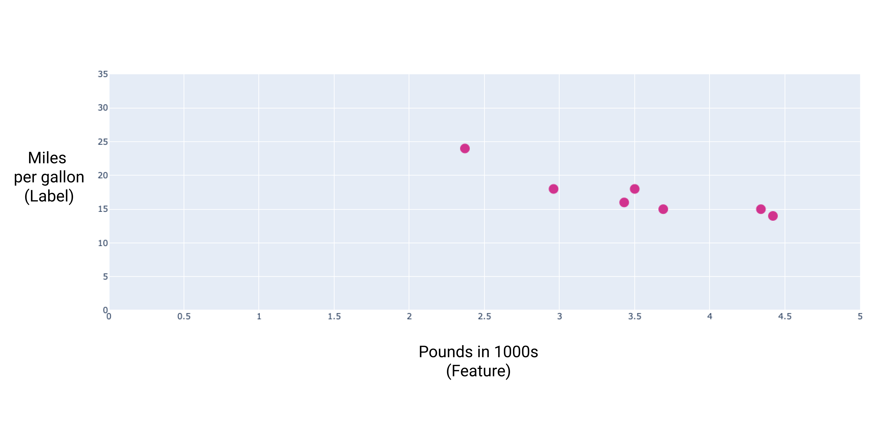
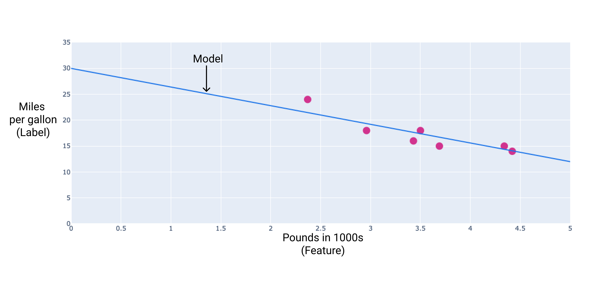
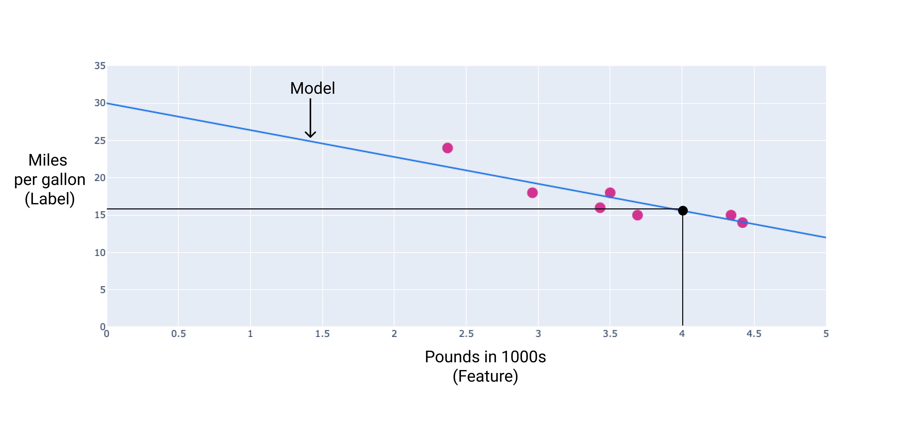
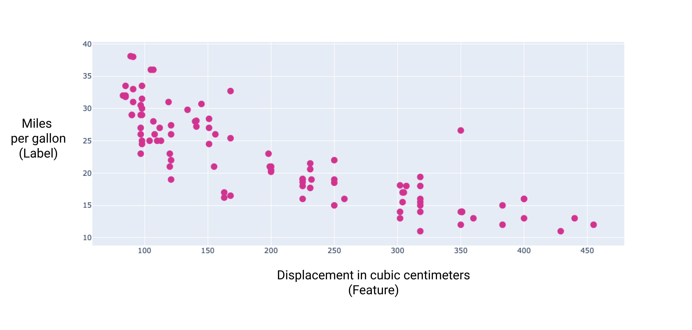

# [Linear regression](https://developers.google.com/machine-learning/crash-course/linear-regression)

> **Learning objectives:**
>
> - Explain a loss function and how it works.
> - Define and describe how gradient descent finds the optimal model parameters.
> - Describe how to tune hyperparameters to efficiently train a linear model.

**Linear regression** is a statistical technique used to find the relationship between variables. In an ML context, linear regression ==finds the relationship between **features** and a **label**.==

For example, suppose we want to predict <u>a car's fuel efficiency</u> in **miles per gallon** based on **how heavy the car is**, and we have the following dataset:

| Pounds in 1000s (feature) | Miles per gallon (label) |
| :------------------------ | :----------------------- |
| 3.5                       | 18                       |
| 3.69                      | 15                       |
| 3.44                      | 18                       |
| 3.43                      | 16                       |
| 4.34                      | 15                       |
| 4.42                      | 14                       |
| 2.37                      | 24                       |

If we plotted these points, we'd get the following graph:

**Figure 1**. Car heaviness(in pounds) VS miles per gallon rating. As a car gets heavier, its miles per gallon rating generally decreases.

We could create our own model by drawing a best fit line最佳拟合线 through the points:

**Figure 2**. A best fit line drawn through the data from the previous figure.

## Linear regression equation

In algebraic terms, the model would be defined as $y=mx+b$, where

- $y$ is ==miles per gallon==——the value we want to predict.
- $m$ is the ==slope== of the line.
- $x$ is ==pounds(input)==.
- $b$ is ==y-intercept==.

In ML, we write the equation for a linear regression model as follows:
$$
y' = b + w_1x_1
$$
where:

- $y′$ is the predicted label——the output.
- $b$ is the [**bias**](https://developers.google.com/machine-learning/glossary#bias-math-or-bias-term) of the model. Bias is the same concept as the y-intercept in the algebraic equation for a line. In ML, bias is sometimes referred to as $w_0$. 
   Bias is a [**parameter**](https://developers.google.com/machine-learning/glossary#parameter) of the model and is calculated during training.
- $w_1$ is the [**weight**](https://developers.google.com/machine-learning/glossary#weight) of the feature. Weight is the same concept as the slope $m$ in the algebraic equation for a line. 
   Weight is a [**parameter**](https://developers.google.com/machine-learning/glossary#parameter) of the model and is calculated during training.
- $x_1$ is a [**feature**](https://developers.google.com/machine-learning/glossary#feature)—the input.

During training, the model calculates the weight and bias that produce the best model.

**Figure 3**. Mathematical representation of a linear model.

In our example, we'd calculate the weight and bias from the line we drew. The bias is 30 (where the line intersects the y-axis), and the weight(slope) is -3.6 . The model would be defined as $y′=30+(−3.6)(x_1)$, and we could use it to make predictions. 
For instance, using this model, a 4,000-pound car would have a predicted fuel efficiency of 15.6 miles per gallon.

**Figure 4**. Using the model, a 4,000-pound car has a predicted fuel efficiency of 15.6 miles per gallon.

### Models with ==multiple features==

Although the example in this section uses only one feature—the heaviness of the car—a more sophisticated model might rely on multiple features, each having a separate weight $(w1, w2, etc.)$. For example, a model that relies on five features would be written as follows:
$$
y' = b+w_1x_1 + w_2x_2 + w_3x_3 + w_4x_4 + w_5x_5
$$
For example, a model that predicts gas mileage could additionally use features such as the following:

- Engine displacement排量(本意排水量)
- Acceleration加速能力
- Number of cylinders气缸数量
- Horsepower马力

This model would be written as follows:

**Figure 5**. A model with five features to predict a car's miles per gallon rating.

By graphing some of these additional features, we can see that they also have <u>a linear relationship</u> to the label, miles per gallon:

**Figure 6**. A car's displacement in cubic centimeters and its miles per gallon rating. 
As a car's engine gets bigger, its miles per gallon rating generally decreases.

**Figure 7**. A car's acceleration and its miles per gallon rating. 
As a car's acceleration takes longer, the miles per gallon rating generally increases.

**Figure 8**. A car's horsepower and its miles per gallon rating. 
As a car's horsepower increases, the miles per gallon rating generally decreases.

[下一篇：loss](C:\Users\fangw\Desktop\practical_training\知识点\ML_models\1_linear_regression\2_loss\loss.md)
